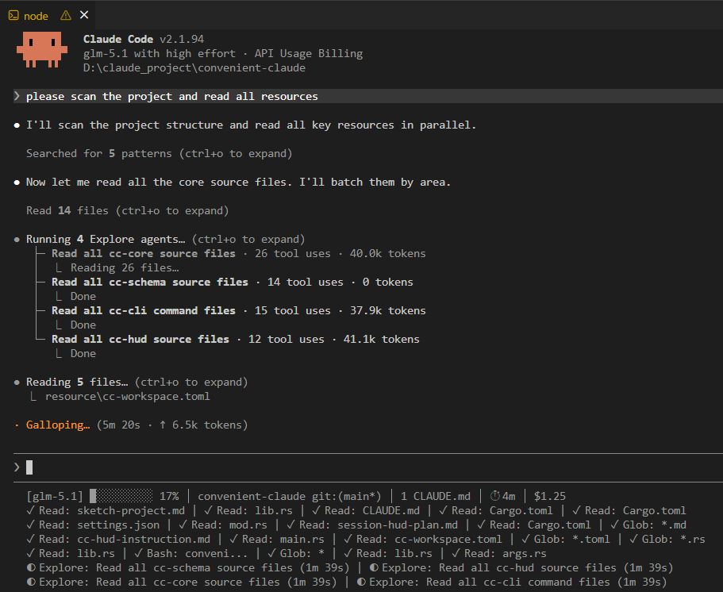

# convenient-claude

A Rust CLI package manager for Claude Code resources — skills, agents, commands, hooks, and rules. Single native binary that manages the full lifecycle of Claude Code configuration.

## Project Overview

- **Language**: Rust (edition 2021)
- **Build**: `cargo build --release` → `target/release/cc.exe`
- **Test**: `cargo test --all`
- **Lint**: `cargo clippy --all`
- **Format**: `cargo fmt`

## Workspace Crates

| Crate | Purpose |
|-------|---------|
| `cc-schema` | Data layer — structs, YAML frontmatter parsing, file I/O |
| `cc-core` | Service layer — resource resolution, session management, validation |
| `cc-hud` | HUD status line renderer for Claude Code's status bar |
| `cc-cli` | CLI entrypoint with clap subcommands + ratatui TUI |

**Dependency graph:** `cc-cli → cc-core → cc-schema`, `cc-cli → cc-hud`

## CLI Commands

```
cc
├── init                     # Initialize .claude/ in a project
├── list <type> [filter]     # List resources (skills, commands, agents, hooks, rules)
├── add <type> <name>        # Install a resource
├── remove <type> <name>     # Uninstall a resource
├── show <type> <name>       # Display resource details + origin
├── validate [--fix]         # Validate all project resources
├── session                  # Session management
│   ├── start [--mode]       # Start session (conversation|loop|interactive)
│   ├── stop                 # Stop session and save stats
│   ├── status               # Show active session info
│   ├── stats                # Show token usage
│   ├── hud [--layout]       # Run HUD status line (reads JSON from stdin)
│   └── setup-hud            # Print settings.json statusLine command
├── config                   # View/edit merged configuration
├── stats                    # Resource and token usage analytics
├── doctor                   # Diagnose setup issues
└── tui                      # Launch interactive TUI dashboard
```

## Resource Origins (precedence: lowest → highest)

| Origin | Location | Scope |
|--------|----------|-------|
| External | `extern/` (git submodules) | Shared community resources |
| User | `~/.claude/` | User-wide defaults |
| Project | `.claude/` within project | Project-specific |

## HUD Status Line

The `cc session hud` command provides a native Rust status line for Claude Code:

```bash
# Generate settings.json entry
cc session setup-hud
```

Add the output to `~/.claude/settings.json` under `"statusLine"`. Restart the Claude Code. The HUD will read JSON input from stdin and render a dynamic status line with token usage, active skills, and session info.


## Architecture

```
┌─────────────────────────────────────────────────────┐
│ CLI Layer (cc-cli)                                  │
│ clap derive • command dispatch • ratatui TUI        │
├─────────────────────────────────────────────────────┤
│ Service Layer (cc-core)                             │
│ resource resolution • session management            │
│ conflict resolution • validation                    │
├─────────────────────────────────────────────────────┤
│ Data Layer (cc-schema)                              │
│ schema definitions • frontmatter parsing            │
│ JSON/TOML/YAML serialization                        │
├─────────────────────────────────────────────────────┤
│ HUD Renderer (cc-hud)                               │
│ stdin parsing • transcript parsing • ANSI render    │
└─────────────────────────────────────────────────────┘
```

## Key Files

| Path | Purpose |
|------|---------|
| `resource/cc-workspace.toml` | Registry of external libs, plugin dirs, current project |
| `.claude/settings.json` | Project permissions and hooks |
| `extern/claude-skills/` | Community skill library (git submodule) |
| `extern/everything-claude-code/` | ECC tools including TUI app |

## Conventions

- Follow standard Rust conventions (rustfmt, clippy)
- Resources use Markdown + YAML frontmatter (skills, commands, agents)
- Rules are plain Markdown files
- Hooks are stored in `settings.json` under `"hooks"`
- All resources resolve by precedence (highest wins)
